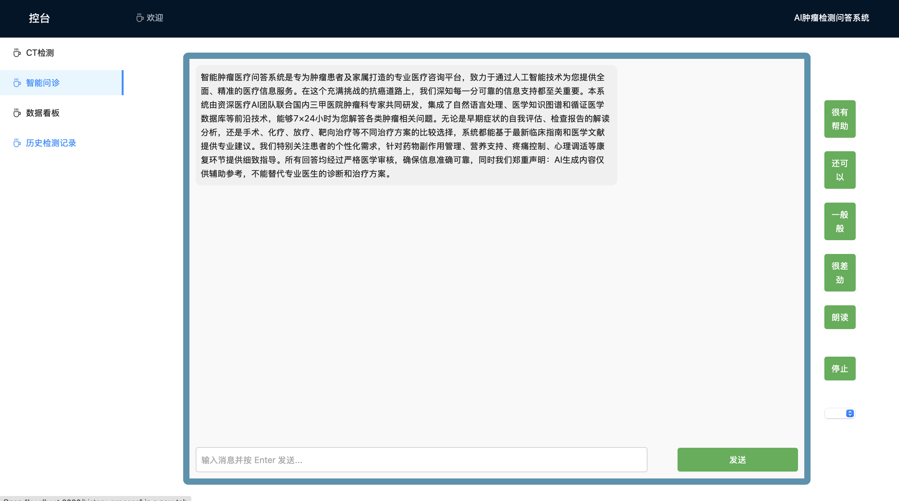
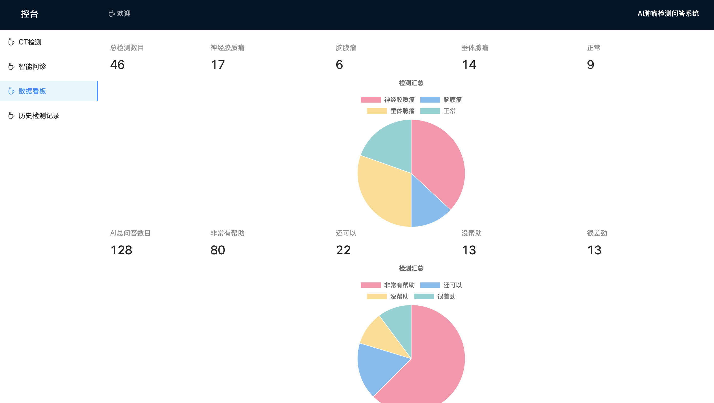
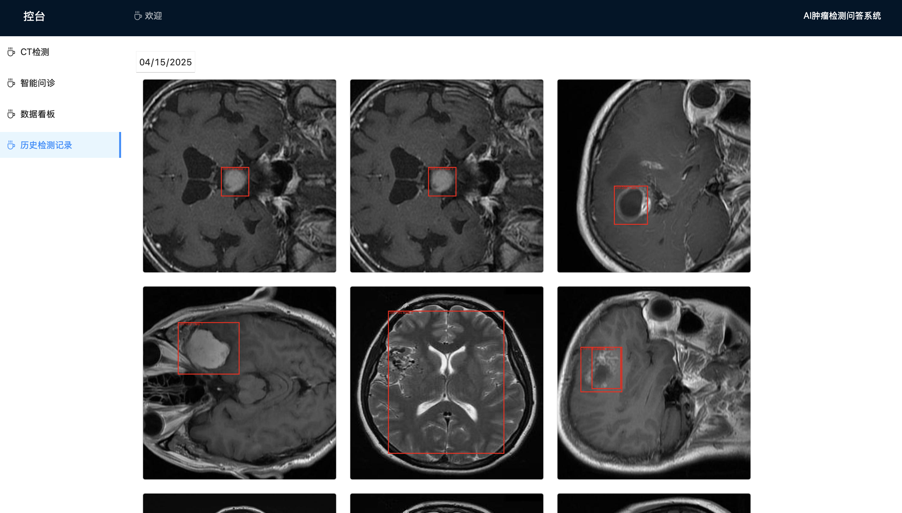

# 脑部肿瘤医学影像检测系统前端
## 简介
本项目是基于VUE3开发的脑部肿瘤医学影像检测系统的前端页面，目的是显示操作界面给用户使用，内容包括后端处理得到的CT检测结果，AI问答系统，数据统计，历史记录等。


## 主要功能概述
+ 在CT检测页面，用户上传图片，等待系统检测，系统检测CT图片后，会将图片反馈至这个页面，并附加相应信息


+ 在智能问诊页面，用户可以与AI问答系统进行交互，询问与病情，健康相关等问题，并得到回复


+ 在数据看板页面，管理者可以查看总共检测数目，以及各种不同病症的检测数目，还可以得到用户对AI问答系统的反馈，数据会以数字以及饼图的形式展现


+ 在历史检测记录页面，用户可以查看指定日期的检测记录


## 效果
+ 用户上传待检测CT图片，接受结果页面


+ 用户根据检测结果，与AI进行问答页面


+ 管理者查看系统检测数目，用户反馈页面


+ 历史检测记录页面



## 项目结构
+ src/Views文件夹

    用于存放提供不同功能的页面
+ src/components文件夹

    用于存放提供不同功能的页面组件
+ src/router文件夹

    用于存放提供路由
+ src/components文件夹

    用于存放提供不同功能的页面组件
+ package.json

    项目所需要的依赖都在这里

## 部署方法
```plain
安装Node.js
```
```plain
将代码拉取至本地
```
```plain
npm install @vue/cli //安装vue所需要的依赖
```
```plain
cd 项目根目录 //进入到项目
```
```plain
npm install //安装所有项目用到的依赖
```
```plain
npm rum serve // 启动应用，启动前端项目前先启动后端应用
```

```plain
http://localhost:8080 // 在浏览器访问服务器地址即可
```

## 后端项目与详细信息请参考以下地址
```plain
https://github.com/GonnaBeStrong/CT-Scanning
```


