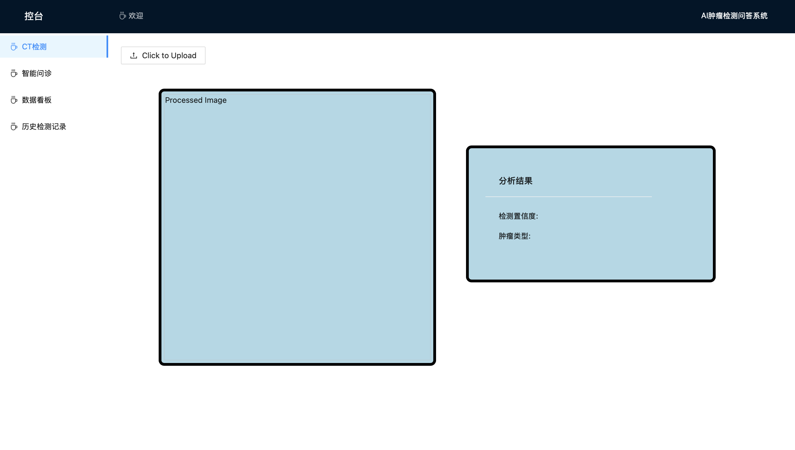

# 脑部肿瘤医学影像检测系统前端
## 简介
本项目是基于VUE3开发的脑部肿瘤医学影像检测系统的前端页面，目的是显示操作界面给用户，将后端处理得到的结果展示出来。

## 功能
+ 在CT检测页面，用户上传图片，等待系统检测，系统检测CT图片后，会将图片反馈至这个页面，并附加相应信息

+ 在智能问诊页面，用户可以与AI问答系统进行交互，询问与病情，健康相关等问题，并得到回复

+ 在数据看板页面，管理者可以查看总共检测数目，以及各种不同病症的检测数目，还可以得到用户对AI问答系统的反馈，数据会以数字以及饼图的形式展现

+ 在历史检测记录页面，用户可以查看指定日期的检测记录

## 效果
+ 用户上传待检测CT图片，接受结果页面

+ 用户根据检测结果，与AI进行问答页面

+ 管理者查看系统检测数目，用户反馈页面

+ 历史检测记录页面

## 项目结构
### 1. 整体结构

### 2. 详细结构
+ Components文件夹用于存放页面边栏和顶栏

+ Views文件夹

    用于存放提供不同功能的页面

